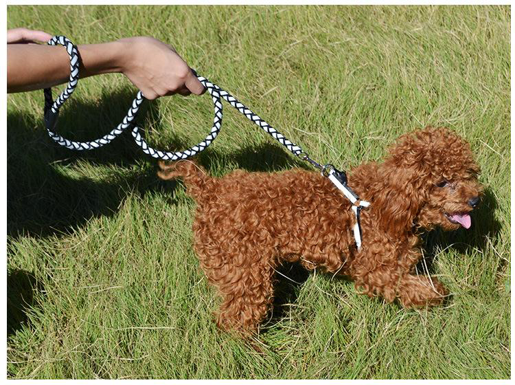

## 一、遛狗牵绳检测

### 1.项目简介
当今社会，遛狗不牵绳已经造成很多悲剧，常见小孩被狗咬，或小狗跑入机动车道一命呜呼，或因不牵绳惊吓老人小孩造成邻里不和，诸如此类举不胜举，因此，开发一种能够智能监控遛狗行为的智能摄像头迫在眉睫。本项目着眼智能检测遛狗行为应运而生。


### 2.数据集介绍
通过爬取百度图片上千条遛狗图片，并人工筛选合用图片，并通过 EasyDL进行智能标注。


## 二、数据集获取

### 1.爬取百度图片
该代码建议终端下运行
```
python get_pic.py
```


```python
import requests
import re
import os


def get_pic():
    headers = {
        'User-Agent': 'Mozilla/5.0 (Windows NT 10.0; Win64; x64) AppleWebKit/537.36 (KHTML, like Gecko) Chrome/84.0.4147.125 Safari/537.36'}
    name = input('您要爬取什么图片: ')
    num = 0
    num_1 = 0
    num_2 = 0
    x = input('您要爬取几张呢?，输入1等于60张图片: ')
    list_1 = []
    for i in range(int(x)):
        name_1 = os.getcwd()
        name_2 = os.path.join(name_1, '图片')
        url = 'https://image.baidu.com/search/flip?tn=baiduimage&ie=utf-8&word=' + name + '&pn=' + str(i * 30)
        res = requests.get(url, headers=headers)
        htlm_1 = res.content.decode()
        a = re.findall('"objURL":"(.*?)",', htlm_1)
        if not os.path.exists(name_2):
            os.makedirs(name_2)
        for b in a:
            try:
                b_1 = re.findall('https:(.*?)&', b)
                b_2 = ''.join(b_1)
                if b_2 not in list_1:
                    num = num + 1
                    img = requests.get(b)
                    f = open(os.path.join(name_1, '图片', name + str(num) + '.jpg'), 'ab')
                    print('---------正在下载第' + str(num) + '张图片----------')
                    f.write(img.content)
                    f.close()
                    list_1.append(b_2)
                elif b_2 in list_1:
                    num_1 = num_1 + 1
                    continue
            except Exception as e:
                print('---------第' + str(num) + '张图片无法下载----------')
                num_2 = num_2 + 1
                continue
    print('下载完成,总共下载{}张,成功下载:{}张,重复下载:{}张,下载失败:{}张'.format(num + num_1 + num_2, num, num_1, num_2))


if __name__ == '__main__':
    get_pic()

```

### 2. EasyDL数据标注


### 3.数据导入AI Studio
新建数据集，选择EasyData导入即可，如下图所示：


### 4.数据解压缩


```python
!unzip -qoa data/data129006/DatasetId_307039_1645455309.zip
```

### 5.数据查看


```python
!tree DatasetId_307039_1645455309 -L 1
```

    DatasetId_307039_1645455309
    ├── Annotations
    └── Images
    
    2 directories, 0 files


```python
from PIL import Image

img=Image.open('DatasetId_307039_1645455309/Images/055a092f09b507a303ca816b146b357f5650e1599de5e30449710f6323976cd2.jpeg')
img
```





```python
!cat DatasetId_307039_1645455309/Annotations/055a092f09b507a303ca816b146b357f5650e1599de5e30449710f6323976cd2.xml
```

    <?xml version='1.0' encoding='UTF-8'?>
    <annotation>
      <filename>055a092f09b507a303ca816b146b357f5650e1599de5e30449710f6323976cd2.jpeg</filename>
      <object_num>2</object_num>
      <size>
        <width>750</width>
        <height>560</height>
      </size>
      <object>
        <name>DOG</name>
        <difficult>0</difficult>
        <bndbox>
          <xmin>173</xmin>
          <ymin>86</ymin>
          <xmax>737</xmax>
          <ymax>494</ymax>
        </bndbox>
      </object>
      <object>
        <name>ROPE</name>
        <difficult>0</difficult>
        <bndbox>
          <xmin>35</xmin>
          <ymin>64</ymin>
          <xmax>559</xmax>
          <ymax>275</ymax>
        </bndbox>
      </object>
    </annotation>


## 三、PaddleX环境准备

###  1.PaddleX安装


```python
!pip install paddlex
```

    Looking in indexes: https://pypi.tuna.tsinghua.edu.cn/simple
    Collecting paddlex
      Downloading https://pypi.tuna.tsinghua.edu.cn/packages/ca/03/b401c6a34685aa698e7c2fbcfad029892cbfa4b562eaaa7722037fef86ed/paddlex-2.1.0-py3-none-any.whl (1.6 MB)
         |████████████████████████████████| 1.6 MB 7.2 MB/s            
    [?25hRequirement already satisfied: tqdm in /opt/conda/envs/python35-paddle120-env/lib/python3.7/site-packages (from paddlex) (4.27.0)
    Collecting visualdl>=2.2.2
      Downloading https://pypi.tuna.tsinghua.edu.cn/packages/87/c8/10d0d24822637d8e5493a73ad118640530195e45b1c71ae0e60606ff5f0e/visualdl-2.2.3-py3-none-any.whl (2.7 MB)
         |████████████████████████████████| 2.7 MB 2.9 MB/s            
    [?25hCollecting pycocotools
      Downloading https://pypi.tuna.tsinghua.edu.cn/packages/75/5c/ac61ea715d7a89ecc31c090753bde28810238225ca8b71778dfe3e6a68bc/pycocotools-2.0.4.tar.gz (106 kB)
         |████████████████████████████████| 106 kB 6.0 MB/s            
    [?25h  Installing build dependencies ... [?25ldone
    [?25h  Getting requirements to build wheel ... [?25ldone
    [?25h  Preparing metadata (pyproject.toml) ... [?25ldone
    [?25hCollecting shapely>=1.7.0
      Downloading https://pypi.tuna.tsinghua.edu.cn/packages/9d/4d/4b0d86ed737acb29c5e627a91449470a9fb914f32640db3f1cb7ba5bc19e/Shapely-1.8.1.post1-cp37-cp37m-manylinux_2_12_x86_64.manylinux2010_x86_64.whl (2.0 MB)
         |████████████████████████████████| 2.0 MB 5.4 MB/s            
    [?25hRequirement already satisfied: openpyxl in /opt/conda/envs/python35-paddle120-env/lib/python3.7/site-packages (from paddlex) (3.0.5)
    Requirement already satisfied: pyyaml in /opt/conda/envs/python35-paddle120-env/lib/python3.7/site-packages (from paddlex) (5.1.2)
    Requirement already satisfied: chardet in /opt/conda/envs/python35-paddle120-env/lib/python3.7/site-packages (from paddlex) (3.0.4)
    Collecting scikit-learn==0.23.2
      Downloading https://pypi.tuna.tsinghua.edu.cn/packages/f4/cb/64623369f348e9bfb29ff898a57ac7c91ed4921f228e9726546614d63ccb/scikit_learn-0.23.2-cp37-cp37m-manylinux1_x86_64.whl (6.8 MB)
         |████████████████████████████████| 6.8 MB 3.1 MB/s            
    [?25hRequirement already satisfied: opencv-python in /opt/conda/envs/python35-paddle120-env/lib/python3.7/site-packages (from paddlex) (4.1.1.26)
    Requirement already satisfied: scipy in /opt/conda/envs/python35-paddle120-env/lib/python3.7/site-packages (from paddlex) (1.6.3)
    Collecting lap
      Downloading https://pypi.tuna.tsinghua.edu.cn/packages/bf/64/d9fb6a75b15e783952b2fec6970f033462e67db32dc43dfbb404c14e91c2/lap-0.4.0.tar.gz (1.5 MB)
         |████████████████████████████████| 1.5 MB 3.2 MB/s            
    [?25h  Preparing metadata (setup.py) ... [?25ldone
    [?25hCollecting motmetrics
      Downloading https://pypi.tuna.tsinghua.edu.cn/packages/9c/28/9c3bc8e2a87f4c9e7b04ab72856ec7f9895a66681a65973ffaf9562ef879/motmetrics-1.2.0-py3-none-any.whl (151 kB)
         |████████████████████████████████| 151 kB 4.2 MB/s            
    [?25hRequirement already satisfied: colorama in /opt/conda/envs/python35-paddle120-env/lib/python3.7/site-packages (from paddlex) (0.4.4)
    Collecting paddleslim==2.2.1
      Downloading https://pypi.tuna.tsinghua.edu.cn/packages/0b/dc/f46c4669d4cb35de23581a2380d55bf9d38bb6855aab1978fdb956d85da6/paddleslim-2.2.1-py3-none-any.whl (310 kB)
         |████████████████████████████████| 310 kB 5.3 MB/s            
    [?25hRequirement already satisfied: flask-cors in /opt/conda/envs/python35-paddle120-env/lib/python3.7/site-packages (from paddlex) (3.0.8)
    Requirement already satisfied: pillow in /opt/conda/envs/python35-paddle120-env/lib/python3.7/site-packages (from paddleslim==2.2.1->paddlex) (8.2.0)
    Requirement already satisfied: pyzmq in /opt/conda/envs/python35-paddle120-env/lib/python3.7/site-packages (from paddleslim==2.2.1->paddlex) (22.3.0)
    Requirement already satisfied: matplotlib in /opt/conda/envs/python35-paddle120-env/lib/python3.7/site-packages (from paddleslim==2.2.1->paddlex) (2.2.3)
    Requirement already satisfied: numpy>=1.13.3 in /opt/conda/envs/python35-paddle120-env/lib/python3.7/site-packages (from scikit-learn==0.23.2->paddlex) (1.19.5)
    Requirement already satisfied: joblib>=0.11 in /opt/conda/envs/python35-paddle120-env/lib/python3.7/site-packages (from scikit-learn==0.23.2->paddlex) (0.14.1)
    Requirement already satisfied: threadpoolctl>=2.0.0 in /opt/conda/envs/python35-paddle120-env/lib/python3.7/site-packages (from scikit-learn==0.23.2->paddlex) (2.1.0)
    Requirement already satisfied: bce-python-sdk in /opt/conda/envs/python35-paddle120-env/lib/python3.7/site-packages (from visualdl>=2.2.2->paddlex) (0.8.53)
    Requirement already satisfied: requests in /opt/conda/envs/python35-paddle120-env/lib/python3.7/site-packages (from visualdl>=2.2.2->paddlex) (2.24.0)
    Requirement already satisfied: flask>=1.1.1 in /opt/conda/envs/python35-paddle120-env/lib/python3.7/site-packages (from visualdl>=2.2.2->paddlex) (1.1.1)
    Requirement already satisfied: pandas in /opt/conda/envs/python35-paddle120-env/lib/python3.7/site-packages (from visualdl>=2.2.2->paddlex) (1.1.5)
    Requirement already satisfied: Flask-Babel>=1.0.0 in /opt/conda/envs/python35-paddle120-env/lib/python3.7/site-packages (from visualdl>=2.2.2->paddlex) (1.0.0)
    Requirement already satisfied: flake8>=3.7.9 in /opt/conda/envs/python35-paddle120-env/lib/python3.7/site-packages (from visualdl>=2.2.2->paddlex) (4.0.1)
    Requirement already satisfied: shellcheck-py in /opt/conda/envs/python35-paddle120-env/lib/python3.7/site-packages (from visualdl>=2.2.2->paddlex) (0.7.1.1)
    Requirement already satisfied: six>=1.14.0 in /opt/conda/envs/python35-paddle120-env/lib/python3.7/site-packages (from visualdl>=2.2.2->paddlex) (1.16.0)
    Requirement already satisfied: protobuf>=3.11.0 in /opt/conda/envs/python35-paddle120-env/lib/python3.7/site-packages (from visualdl>=2.2.2->paddlex) (3.14.0)
    Requirement already satisfied: pre-commit in /opt/conda/envs/python35-paddle120-env/lib/python3.7/site-packages (from visualdl>=2.2.2->paddlex) (1.21.0)
    Collecting flake8-import-order
      Downloading https://pypi.tuna.tsinghua.edu.cn/packages/ab/52/cf2d6e2c505644ca06de2f6f3546f1e4f2b7be34246c9e0757c6048868f9/flake8_import_order-0.18.1-py2.py3-none-any.whl (15 kB)
    Collecting pytest-benchmark
      Downloading https://pypi.tuna.tsinghua.edu.cn/packages/2c/60/423a63fb190a0483d049786a121bd3dfd7d93bb5ff1bb5b5cd13e5df99a7/pytest_benchmark-3.4.1-py2.py3-none-any.whl (50 kB)
         |████████████████████████████████| 50 kB 1.8 MB/s             
    [?25hCollecting xmltodict>=0.12.0
      Downloading https://pypi.tuna.tsinghua.edu.cn/packages/28/fd/30d5c1d3ac29ce229f6bdc40bbc20b28f716e8b363140c26eff19122d8a5/xmltodict-0.12.0-py2.py3-none-any.whl (9.2 kB)
    Collecting pytest
      Downloading https://pypi.tuna.tsinghua.edu.cn/packages/38/93/c7c0bd1e932b287fb948eb9ce5a3d6307c9fc619db1e199f8c8bc5dad95f/pytest-7.0.1-py3-none-any.whl (296 kB)
         |████████████████████████████████| 296 kB 4.9 MB/s            
    [?25hRequirement already satisfied: et-xmlfile in /opt/conda/envs/python35-paddle120-env/lib/python3.7/site-packages (from openpyxl->paddlex) (1.0.1)
    Requirement already satisfied: jdcal in /opt/conda/envs/python35-paddle120-env/lib/python3.7/site-packages (from openpyxl->paddlex) (1.4.1)
    Requirement already satisfied: importlib-metadata<4.3 in /opt/conda/envs/python35-paddle120-env/lib/python3.7/site-packages (from flake8>=3.7.9->visualdl>=2.2.2->paddlex) (4.2.0)
    Requirement already satisfied: mccabe<0.7.0,>=0.6.0 in /opt/conda/envs/python35-paddle120-env/lib/python3.7/site-packages (from flake8>=3.7.9->visualdl>=2.2.2->paddlex) (0.6.1)
    Requirement already satisfied: pycodestyle<2.9.0,>=2.8.0 in /opt/conda/envs/python35-paddle120-env/lib/python3.7/site-packages (from flake8>=3.7.9->visualdl>=2.2.2->paddlex) (2.8.0)
    Requirement already satisfied: pyflakes<2.5.0,>=2.4.0 in /opt/conda/envs/python35-paddle120-env/lib/python3.7/site-packages (from flake8>=3.7.9->visualdl>=2.2.2->paddlex) (2.4.0)
    Requirement already satisfied: click>=5.1 in /opt/conda/envs/python35-paddle120-env/lib/python3.7/site-packages (from flask>=1.1.1->visualdl>=2.2.2->paddlex) (7.0)
    Requirement already satisfied: Jinja2>=2.10.1 in /opt/conda/envs/python35-paddle120-env/lib/python3.7/site-packages (from flask>=1.1.1->visualdl>=2.2.2->paddlex) (2.11.0)
    Requirement already satisfied: Werkzeug>=0.15 in /opt/conda/envs/python35-paddle120-env/lib/python3.7/site-packages (from flask>=1.1.1->visualdl>=2.2.2->paddlex) (0.16.0)
    Requirement already satisfied: itsdangerous>=0.24 in /opt/conda/envs/python35-paddle120-env/lib/python3.7/site-packages (from flask>=1.1.1->visualdl>=2.2.2->paddlex) (1.1.0)
    Requirement already satisfied: Babel>=2.3 in /opt/conda/envs/python35-paddle120-env/lib/python3.7/site-packages (from Flask-Babel>=1.0.0->visualdl>=2.2.2->paddlex) (2.8.0)
    Requirement already satisfied: pytz in /opt/conda/envs/python35-paddle120-env/lib/python3.7/site-packages (from Flask-Babel>=1.0.0->visualdl>=2.2.2->paddlex) (2019.3)
    Requirement already satisfied: pyparsing!=2.0.4,!=2.1.2,!=2.1.6,>=2.0.1 in /opt/conda/envs/python35-paddle120-env/lib/python3.7/site-packages (from matplotlib->paddleslim==2.2.1->paddlex) (3.0.7)
    Requirement already satisfied: kiwisolver>=1.0.1 in /opt/conda/envs/python35-paddle120-env/lib/python3.7/site-packages (from matplotlib->paddleslim==2.2.1->paddlex) (1.1.0)
    Requirement already satisfied: cycler>=0.10 in /opt/conda/envs/python35-paddle120-env/lib/python3.7/site-packages (from matplotlib->paddleslim==2.2.1->paddlex) (0.10.0)
    Requirement already satisfied: python-dateutil>=2.1 in /opt/conda/envs/python35-paddle120-env/lib/python3.7/site-packages (from matplotlib->paddleslim==2.2.1->paddlex) (2.8.2)
    Requirement already satisfied: future>=0.6.0 in /opt/conda/envs/python35-paddle120-env/lib/python3.7/site-packages (from bce-python-sdk->visualdl>=2.2.2->paddlex) (0.18.0)
    Requirement already satisfied: pycryptodome>=3.8.0 in /opt/conda/envs/python35-paddle120-env/lib/python3.7/site-packages (from bce-python-sdk->visualdl>=2.2.2->paddlex) (3.9.9)
    Requirement already satisfied: setuptools in /opt/conda/envs/python35-paddle120-env/lib/python3.7/site-packages (from flake8-import-order->motmetrics->paddlex) (56.2.0)
    Requirement already satisfied: cfgv>=2.0.0 in /opt/conda/envs/python35-paddle120-env/lib/python3.7/site-packages (from pre-commit->visualdl>=2.2.2->paddlex) (2.0.1)
    Requirement already satisfied: toml in /opt/conda/envs/python35-paddle120-env/lib/python3.7/site-packages (from pre-commit->visualdl>=2.2.2->paddlex) (0.10.0)
    Requirement already satisfied: identify>=1.0.0 in /opt/conda/envs/python35-paddle120-env/lib/python3.7/site-packages (from pre-commit->visualdl>=2.2.2->paddlex) (1.4.10)
    Requirement already satisfied: nodeenv>=0.11.1 in /opt/conda/envs/python35-paddle120-env/lib/python3.7/site-packages (from pre-commit->visualdl>=2.2.2->paddlex) (1.3.4)
    Requirement already satisfied: aspy.yaml in /opt/conda/envs/python35-paddle120-env/lib/python3.7/site-packages (from pre-commit->visualdl>=2.2.2->paddlex) (1.3.0)
    Requirement already satisfied: virtualenv>=15.2 in /opt/conda/envs/python35-paddle120-env/lib/python3.7/site-packages (from pre-commit->visualdl>=2.2.2->paddlex) (16.7.9)
    Collecting tomli>=1.0.0
      Downloading https://pypi.tuna.tsinghua.edu.cn/packages/97/75/10a9ebee3fd790d20926a90a2547f0bf78f371b2f13aa822c759680ca7b9/tomli-2.0.1-py3-none-any.whl (12 kB)
    Requirement already satisfied: attrs>=19.2.0 in /opt/conda/envs/python35-paddle120-env/lib/python3.7/site-packages (from pytest->motmetrics->paddlex) (21.4.0)
    Requirement already satisfied: packaging in /opt/conda/envs/python35-paddle120-env/lib/python3.7/site-packages (from pytest->motmetrics->paddlex) (21.3)
    Requirement already satisfied: pluggy<2.0,>=0.12 in /opt/conda/envs/python35-paddle120-env/lib/python3.7/site-packages (from pytest->motmetrics->paddlex) (0.13.1)
    Collecting iniconfig
      Downloading https://pypi.tuna.tsinghua.edu.cn/packages/9b/dd/b3c12c6d707058fa947864b67f0c4e0c39ef8610988d7baea9578f3c48f3/iniconfig-1.1.1-py2.py3-none-any.whl (5.0 kB)
    Collecting py>=1.8.2
      Downloading https://pypi.tuna.tsinghua.edu.cn/packages/f6/f0/10642828a8dfb741e5f3fbaac830550a518a775c7fff6f04a007259b0548/py-1.11.0-py2.py3-none-any.whl (98 kB)
         |████████████████████████████████| 98 kB 4.6 MB/s             
    [?25hCollecting py-cpuinfo
      Downloading https://pypi.tuna.tsinghua.edu.cn/packages/e6/ba/77120e44cbe9719152415b97d5bfb29f4053ee987d6cb63f55ce7d50fadc/py-cpuinfo-8.0.0.tar.gz (99 kB)
         |████████████████████████████████| 99 kB 4.7 MB/s             
    [?25h  Preparing metadata (setup.py) ... [?25ldone
    [?25hRequirement already satisfied: idna<3,>=2.5 in /opt/conda/envs/python35-paddle120-env/lib/python3.7/site-packages (from requests->visualdl>=2.2.2->paddlex) (2.8)
    Requirement already satisfied: urllib3!=1.25.0,!=1.25.1,<1.26,>=1.21.1 in /opt/conda/envs/python35-paddle120-env/lib/python3.7/site-packages (from requests->visualdl>=2.2.2->paddlex) (1.25.6)
    Requirement already satisfied: certifi>=2017.4.17 in /opt/conda/envs/python35-paddle120-env/lib/python3.7/site-packages (from requests->visualdl>=2.2.2->paddlex) (2019.9.11)
    Requirement already satisfied: zipp>=0.5 in /opt/conda/envs/python35-paddle120-env/lib/python3.7/site-packages (from importlib-metadata<4.3->flake8>=3.7.9->visualdl>=2.2.2->paddlex) (3.7.0)
    Requirement already satisfied: typing-extensions>=3.6.4 in /opt/conda/envs/python35-paddle120-env/lib/python3.7/site-packages (from importlib-metadata<4.3->flake8>=3.7.9->visualdl>=2.2.2->paddlex) (4.0.1)
    Requirement already satisfied: MarkupSafe>=0.23 in /opt/conda/envs/python35-paddle120-env/lib/python3.7/site-packages (from Jinja2>=2.10.1->flask>=1.1.1->visualdl>=2.2.2->paddlex) (2.0.1)
    Building wheels for collected packages: lap, pycocotools, py-cpuinfo
      Building wheel for lap (setup.py) ... [?25ldone
    [?25h  Created wheel for lap: filename=lap-0.4.0-cp37-cp37m-linux_x86_64.whl size=1593880 sha256=d2eced913921a2e9eed4043207707010fded7c8d43159f963b87f7ed6a22812d
      Stored in directory: /home/aistudio/.cache/pip/wheels/5c/d0/d2/e331d17a999666b1e2eb99743cfa1742629f9d26c55c657001
      Building wheel for pycocotools (pyproject.toml) ... [?25ldone
    [?25h  Created wheel for pycocotools: filename=pycocotools-2.0.4-cp37-cp37m-linux_x86_64.whl size=273792 sha256=5cc9747180102fe13cbcfff08d362d1b3d27e1612c51f51a69bdc9074527ca40
      Stored in directory: /home/aistudio/.cache/pip/wheels/c0/01/5f/670dfd20204fc9cc6bf843db4e014acb998f411922e3abc49f
      Building wheel for py-cpuinfo (setup.py) ... [?25ldone
    [?25h  Created wheel for py-cpuinfo: filename=py_cpuinfo-8.0.0-py3-none-any.whl size=22245 sha256=b3971ca7a73690d78bcc41f38bfbcc8bd190aebd241cb45b83ee63e07a111dab
      Stored in directory: /home/aistudio/.cache/pip/wheels/88/c7/d0/6309c7cc9929894c11fe8e516c3e2a0d0a53ee4e198eac48b7
    Successfully built lap pycocotools py-cpuinfo
    Installing collected packages: tomli, py, iniconfig, pytest, py-cpuinfo, xmltodict, pytest-benchmark, flake8-import-order, visualdl, shapely, scikit-learn, pycocotools, paddleslim, motmetrics, lap, paddlex
      Attempting uninstall: visualdl
        Found existing installation: visualdl 2.2.0
        Uninstalling visualdl-2.2.0:
          Successfully uninstalled visualdl-2.2.0
      Attempting uninstall: scikit-learn
        Found existing installation: scikit-learn 0.24.2
        Uninstalling scikit-learn-0.24.2:
          Successfully uninstalled scikit-learn-0.24.2
    Successfully installed flake8-import-order-0.18.1 iniconfig-1.1.1 lap-0.4.0 motmetrics-1.2.0 paddleslim-2.2.1 paddlex-2.1.0 py-1.11.0 py-cpuinfo-8.0.0 pycocotools-2.0.4 pytest-7.0.1 pytest-benchmark-3.4.1 scikit-learn-0.23.2 shapely-1.8.1.post1 tomli-2.0.1 visualdl-2.2.3 xmltodict-0.12.0
    WARNING: You are using pip version 21.3.1; however, version 22.0.3 is available.
    You should consider upgrading via the '/opt/conda/envs/python35-paddle120-env/bin/python -m pip install --upgrade pip' command.


```python
!pip list|grep paddlex
```

    paddlex                2.1.0
    WARNING: You are using pip version 21.3.1; however, version 22.0.3 is available.
    You should consider upgrading via the '/opt/conda/envs/python35-paddle120-env/bin/python -m pip install --upgrade pip' command.


### 2.GPU环境


```python
!nvidia-smi
```

    Tue Feb 22 10:56:47 2022       
    +-----------------------------------------------------------------------------+
    | NVIDIA-SMI 418.67       Driver Version: 418.67       CUDA Version: 10.1     |
    |-------------------------------+----------------------+----------------------+
    | GPU  Name        Persistence-M| Bus-Id        Disp.A | Volatile Uncorr. ECC |
    | Fan  Temp  Perf  Pwr:Usage/Cap|         Memory-Usage | GPU-Util  Compute M. |
    |===============================+======================+======================|
    |   0  Tesla V100-SXM2...  On   | 00000000:05:00.0 Off |                    0 |
    | N/A   35C    P0    40W / 300W |      0MiB / 32480MiB |      0%      Default |
    +-------------------------------+----------------------+----------------------+
                                                                                   
    +-----------------------------------------------------------------------------+
    | Processes:                                                       GPU Memory |
    |  GPU       PID   Type   Process name                             Usage      |
    |=============================================================================|
    |  No running processes found                                                 |
    +-----------------------------------------------------------------------------+


## 四、开始训练
### 1.导入必要的包


```python
# 环境变量配置，用于控制是否使用GPU
# 说明文档：https://paddlex.readthedocs.io/zh_CN/develop/appendix/parameters.html#gpu
import os
# 根据卡的情况设置，此处可以忽略
os.environ['CUDA_VISIBLE_DEVICES'] = '0'

import paddlex as pdx
# 注意和1.x的有区别
from paddlex import transforms as T
```

    [02-22 10:56:49 MainThread @utils.py:79] WRN paddlepaddle version: 2.2.2. The dynamic graph version of PARL is under development, not fully tested and supported


    /opt/conda/envs/python35-paddle120-env/lib/python3.7/site-packages/parl/remote/communication.py:38: DeprecationWarning: 'pyarrow.default_serialization_context' is deprecated as of 2.0.0 and will be removed in a future version. Use pickle or the pyarrow IPC functionality instead.
      context = pyarrow.default_serialization_context()
    /opt/conda/envs/python35-paddle120-env/lib/python3.7/site-packages/matplotlib/__init__.py:107: DeprecationWarning: Using or importing the ABCs from 'collections' instead of from 'collections.abc' is deprecated, and in 3.8 it will stop working
      from collections import MutableMapping
    /opt/conda/envs/python35-paddle120-env/lib/python3.7/site-packages/matplotlib/rcsetup.py:20: DeprecationWarning: Using or importing the ABCs from 'collections' instead of from 'collections.abc' is deprecated, and in 3.8 it will stop working
      from collections import Iterable, Mapping
    /opt/conda/envs/python35-paddle120-env/lib/python3.7/site-packages/matplotlib/colors.py:53: DeprecationWarning: Using or importing the ABCs from 'collections' instead of from 'collections.abc' is deprecated, and in 3.8 it will stop working
      from collections import Sized


### 2.数据集划分


```python
!mv DatasetId_307039_1645455309/Images DatasetId_307039_1645455309/JPEGImages
```


```python
!paddlex --split_dataset --format VOC --dataset_dir DatasetId_307039_1645455309 --val_value 0.2
```

    [02-22 10:56:55 MainThread @logger.py:242] Argv: /opt/conda/envs/python35-paddle120-env/bin/paddlex --split_dataset --format VOC --dataset_dir DatasetId_307039_1645455309 --val_value 0.2
    [02-22 10:56:55 MainThread @utils.py:79] WRN paddlepaddle version: 2.2.2. The dynamic graph version of PARL is under development, not fully tested and supported
    /opt/conda/envs/python35-paddle120-env/lib/python3.7/site-packages/parl/remote/communication.py:38: DeprecationWarning: 'pyarrow.default_serialization_context' is deprecated as of 2.0.0 and will be removed in a future version. Use pickle or the pyarrow IPC functionality instead.
      context = pyarrow.default_serialization_context()
    /opt/conda/envs/python35-paddle120-env/lib/python3.7/site-packages/matplotlib/__init__.py:107: DeprecationWarning: Using or importing the ABCs from 'collections' instead of from 'collections.abc' is deprecated, and in 3.8 it will stop working
      from collections import MutableMapping
    /opt/conda/envs/python35-paddle120-env/lib/python3.7/site-packages/matplotlib/rcsetup.py:20: DeprecationWarning: Using or importing the ABCs from 'collections' instead of from 'collections.abc' is deprecated, and in 3.8 it will stop working
      from collections import Iterable, Mapping
    /opt/conda/envs/python35-paddle120-env/lib/python3.7/site-packages/matplotlib/colors.py:53: DeprecationWarning: Using or importing the ABCs from 'collections' instead of from 'collections.abc' is deprecated, and in 3.8 it will stop working
      from collections import Sized
    2022-02-22 10:56:57 [INFO]	Dataset split starts...
    2022-02-22 10:56:57 [INFO]	Dataset split done.
    2022-02-22 10:56:57 [INFO]	Train samples: 112
    2022-02-22 10:56:57 [INFO]	Eval samples: 28
    2022-02-22 10:56:57 [INFO]	Test samples: 0
    2022-02-22 10:56:57 [INFO]	Split files saved in DatasetId_307039_1645455309


### 2.数据集设置


```python
# 定义训练和验证时的T
# API说明 https://paddlex.readthedocs.io/zh_CN/develop/apis/T/det_T.html
train_transforms = T.Compose([
    # T.MixupImage(mixup_epoch=250), T.RandomDistort(),
    T.RandomExpand(), T.RandomCrop(), T.Resize(
        target_size=608, interp='RANDOM'), T.RandomHorizontalFlip(),
    T.Normalize()
])

eval_transforms = T.Compose([
    T.Resize(
        target_size=608, interp='CUBIC'), T.Normalize()
])

# 定义训练和验证所用的数据集
# API说明：https://paddlex.readthedocs.io/zh_CN/develop/apis/datasets.html#paddlex-datasets-vocdetection
train_dataset = pdx.datasets.VOCDetection(
    data_dir='DatasetId_307039_1645455309',
    file_list='DatasetId_307039_1645455309/train_list.txt',
    label_list='DatasetId_307039_1645455309/labels.txt',
    transforms=train_transforms,
    shuffle=True)
    
eval_dataset = pdx.datasets.VOCDetection(
    data_dir='DatasetId_307039_1645455309',
    file_list='DatasetId_307039_1645455309/val_list.txt',
    label_list='DatasetId_307039_1645455309/labels.txt',
    transforms=eval_transforms)
```

    2022-02-22 10:57:28 [INFO]	Starting to read file list from dataset...
    2022-02-22 10:57:28 [INFO]	112 samples in file DatasetId_307039_1645455309/train_list.txt, including 112 positive samples and 0 negative samples.
    creating index...
    index created!
    2022-02-22 10:57:28 [INFO]	Starting to read file list from dataset...
    2022-02-22 10:57:28 [INFO]	28 samples in file DatasetId_307039_1645455309/val_list.txt, including 28 positive samples and 0 negative samples.
    creating index...
    index created!


### 3.训练


```python
# 初始化模型，并进行训练
# 可使用VisualDL查看训练指标，参考https://paddlex.readthedocs.io/zh_CN/develop/train/visualdl.html
num_classes = len(train_dataset.labels)

# API说明: https://paddlex.readthedocs.io/zh_CN/develop/apis/models/detection.html#paddlex-det-yolov3
model = pdx.det.PPYOLO(num_classes=num_classes)

# API说明: https://paddlex.readthedocs.io/zh_CN/develop/apis/models/detection.html#train
# 各参数介绍与调整说明：https://paddlex.readthedocs.io/zh_CN/develop/appendix/parameters.html
model.train(
    num_epochs=270,
    train_dataset=train_dataset,
    train_batch_size=16,
    eval_dataset=eval_dataset,
    learning_rate=0.000125,
    lr_decay_epochs=[60, 100],
    save_dir='output/ppyolo',
    use_vdl=True)
```

```
2022-02-22 11:06:06 [INFO]	[TRAIN] Epoch 50 finished, loss_xy=1.8030771, loss_wh=1.8415105, loss_iou=5.346631, loss_iou_aware=1.34119, loss_obj=15.676635, loss_cls=2.6728053, loss=28.68185 .
2022-02-22 11:06:06 [WARNING]	Detector only supports single card evaluation with batch_size=1 during evaluation, so batch_size is forcibly set to 1.
2022-02-22 11:06:06 [INFO]	Start to evaluate(total_samples=28, total_steps=28)...
2022-02-22 11:06:08 [INFO]	Accumulating evaluatation results...
2022-02-22 11:06:08 [INFO]	[EVAL] Finished, Epoch=50, bbox_map=2.629171 .
2022-02-22 11:06:08 [INFO]	Current evaluated best model on eval_dataset is epoch_49, bbox_map=15.801246454000003
2022-02-22 11:06:09 [INFO]	Model saved in output/ppyolo/epoch_50.
2022-02-22 11:06:16 [INFO]	[TRAIN] Epoch 51 finished, loss_xy=1.933626, loss_wh=1.8231293, loss_iou=5.459443, loss_iou_aware=1.3223228, loss_obj=17.76362, loss_cls=2.6294556, loss=30.931597 .
2022-02-22 11:06:16 [WARNING]	Detector only supports single card evaluation with batch_size=1 during evaluation, so batch_size is forcibly set to 1.
2022-02-22 11:06:16 [INFO]	Start to evaluate(total_samples=28, total_steps=28)...
2022-02-22 11:06:18 [INFO]	Accumulating evaluatation results...
2022-02-22 11:06:18 [INFO]	[EVAL] Finished, Epoch=51, bbox_map=12.878964 .
2022-02-22 11:06:18 [INFO]	Current evaluated best model on eval_dataset is epoch_49, bbox_map=15.801246454000003
2022-02-22 11:06:19 [INFO]	Model saved in output/ppyolo/epoch_51.
2022-02-22 11:06:23 [INFO]	[TRAIN] Epoch=52/270, Step=3/7, loss_xy=1.921747, loss_wh=1.810229, loss_iou=5.621733, loss_iou_aware=1.493061, loss_obj=16.106371, loss_cls=2.959830, loss=29.912970, lr=0.000125, time_each_step=1.14s, eta=0:36:13
```

## 五、部署

PaddleX已经集成了基于Python的高性能预测接口，下面演示单张图片和视频流的预测效果。


```python
import glob
import numpy as np
import threading
import time
import random
import os
import base64
import cv2
import json
import paddlex as pdx

image_name = 'DatasetId_307039_1645455309/JPEGImages/123db97ceac3101e91fbf1cc74c0c063cf41b44aecf387316442eccf442093d6.jpeg'
model = pdx.load_model('./output/ppyolo/best_model')

img = cv2.imread(image_name)
result = model.predict(img)

keep_results = []
areas = []
f = open('result.txt', 'a')
count = 0
for dt in np.array(result):
    cname, bbox, score = dt['category'], dt['bbox'], dt['score']
    if score < 0.5:
        continue
    keep_results.append(dt)
    count += 1
    f.write(str(dt) + '\n')
    f.write('\n')
    areas.append(bbox[2] * bbox[3])
areas = np.asarray(areas)
sorted_idxs = np.argsort(-areas).tolist()
keep_results = [keep_results[k]
                for k in sorted_idxs] if len(keep_results) > 0 else []
print(keep_results)
print(count)
f.write("the total number is :" + str(int(count)))
f.close()

pdx.det.visualize(
    image_name, result, threshold=0.1, save_dir='./output/ppyolo')

```

    2022-02-22 11:16:27 [INFO]	Model[PPYOLO] loaded.
    []
    0
    2022-02-22 11:16:27 [INFO]	The visualized result is saved at ./output/ppyolo/visualize_123db97ceac3101e91fbf1cc74c0c063cf41b44aecf387316442eccf442093d6.jpeg


### 1.导出预测模型


```python
!paddlex --export_inference --model_dir=./output/ppyolo/best_model --save_dir=./
```

    [02-22 00:33:22 MainThread @logger.py:242] Argv: /opt/conda/envs/python35-paddle120-env/bin/paddlex --export_inference --model_dir=./output/ppyolo/best_model --save_dir=./
    [02-22 00:33:22 MainThread @utils.py:79] WRN paddlepaddle version: 2.2.2. The dynamic graph version of PARL is under development, not fully tested and supported
    /opt/conda/envs/python35-paddle120-env/lib/python3.7/site-packages/parl/remote/communication.py:38: DeprecationWarning: 'pyarrow.default_serialization_context' is deprecated as of 2.0.0 and will be removed in a future version. Use pickle or the pyarrow IPC functionality instead.
      context = pyarrow.default_serialization_context()
    /opt/conda/envs/python35-paddle120-env/lib/python3.7/site-packages/matplotlib/__init__.py:107: DeprecationWarning: Using or importing the ABCs from 'collections' instead of from 'collections.abc' is deprecated, and in 3.8 it will stop working
      from collections import MutableMapping
    /opt/conda/envs/python35-paddle120-env/lib/python3.7/site-packages/matplotlib/rcsetup.py:20: DeprecationWarning: Using or importing the ABCs from 'collections' instead of from 'collections.abc' is deprecated, and in 3.8 it will stop working
      from collections import Iterable, Mapping
    /opt/conda/envs/python35-paddle120-env/lib/python3.7/site-packages/matplotlib/colors.py:53: DeprecationWarning: Using or importing the ABCs from 'collections' instead of from 'collections.abc' is deprecated, and in 3.8 it will stop working
      from collections import Sized
    W0222 00:33:25.207829 15367 device_context.cc:447] Please NOTE: device: 0, GPU Compute Capability: 7.0, Driver API Version: 10.1, Runtime API Version: 10.1
    W0222 00:33:25.212255 15367 device_context.cc:465] device: 0, cuDNN Version: 7.6.
    2022-02-22 00:33:28 [INFO]	Model[PPYOLO] loaded.
    2022-02-22 00:33:28 [WARNING]	[Important!!!] When exporting inference model for PPYOLO, if fixed_input_shape is not set, it will be forcibly set to [None, 3, 608, 608]. Please ensure image shape after transforms is [3, 608, 608], if not, fixed_input_shape should be specified manually.
    2022-02-22 00:33:35 [INFO]	The model for the inference deployment is saved in ./inference_model.


### 2.单张图片预测
选择一张测试集中的图片，查看预测效果


```python
import paddlex as pdx
predictor = pdx.deploy.Predictor('./inference_model')
result = predictor.predict(img_file='DatasetId_307039_1645455309/JPEGImages/2934d66d734b5a8ece26df70c83d0d7168907bace2887a1f79ed0130dd50fa0d.jpeg')
print(result)
```

    2022-02-22 00:40:29 [INFO]	Model[PPYOLO] loaded.
    ------------------ Inference Time Info ----------------------
    total_time(ms): 988.9, img_num: 1, batch_size: 1
    average latency time(ms): 988.90, QPS: 1.011225
    preprocess_time_per_im(ms): 67.10, inference_time_per_batch(ms): 921.70, postprocess_time_per_im(ms): 0.10
    []


```python

```

    []


```python

```
